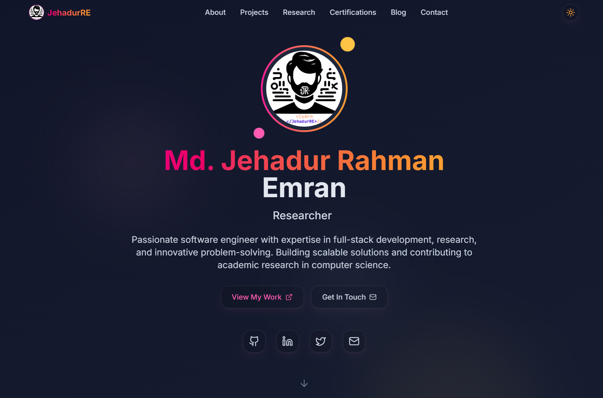
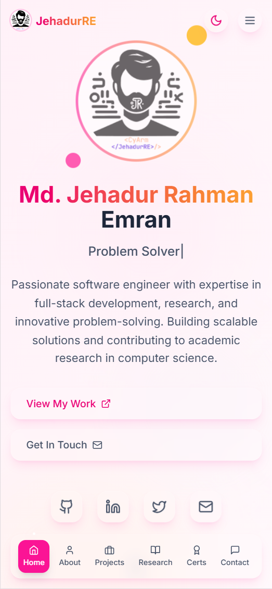

# 🌸 Modern Portfolio Website

<div align="center">

<p align="center">
    
    
</p>

**A beautiful, modern, and fully-featured portfolio website built with React, TypeScript, and Supabase**

[](https://gleaming-gnome-ce2bd0.netlify.app)
[](https://github.com/JehadurRE)
[](LICENSE)

</div>

## ✨ Features

### 🎨 **Modern Design**
- **Glass morphism UI** with beautiful animations
- **Dark/Light theme** toggle with system preference detection
- **Responsive design** optimized for all devices
- **Smooth animations** powered by Framer Motion
- **Type animations** for dynamic text effects

### 🚀 **Core Functionality**
- **Dynamic Hero Section** with animated profile and social links
- **About Section** with skills showcase and achievements
- **Projects Gallery** with GitHub integration and README viewer
- **Research & Publications** section for academic work
- **Certifications & Achievements** with detailed modals
- **Blog System** with full CRUD operations
- **Contact Form** with terminal-style UI
- **Admin Dashboard** for content management

### 🛠️ **Technical Features**
- **Full-stack application** with Supabase backend
- **Real-time data** with automatic updates
- **SEO optimized** with proper meta tags
- **Performance optimized** with lazy loading
- **Type-safe** with TypeScript
- **Accessible** with proper ARIA labels

## 🏗️ **Tech Stack**

### Frontend
- **React 18** - Modern React with hooks
- **TypeScript** - Type-safe development
- **Vite** - Fast build tool and dev server
- **Tailwind CSS** - Utility-first CSS framework
- **Framer Motion** - Animation library
- **Lucide React** - Beautiful icons

### Backend & Database
- **Supabase** - Backend as a Service
- **PostgreSQL** - Relational database
- **Row Level Security** - Secure data access
- **Real-time subscriptions** - Live updates

### Deployment
- **Netlify** - Static site hosting
- **GitHub Actions** - CI/CD pipeline
- **Custom domain** support

## 🚀 **Quick Start**

### Prerequisites

Make sure you have the following installed:
- **Node.js** (v18 or higher)
- **npm** or **yarn**
- **Git**

### 1. Clone the Repository

```bash
git clone https://github.com/JehadurRE/portfolio.git
cd portfolio
```

### 2. Install Dependencies

```bash
npm install
# or
yarn install
```

### 3. Environment Setup

Create a `.env` file in the root directory:

```env
VITE_SUPABASE_URL=your_supabase_project_url
VITE_SUPABASE_ANON_KEY=your_supabase_anon_key
```

### 4. Database Setup

1. Create a new project on [Supabase](https://supabase.com)
2. Run the migration files in `supabase/migrations/` in your Supabase SQL editor
3. Update your environment variables

### 5. Start Development Server

```bash
npm run dev
# or
yarn dev
```

Visit `http://localhost:5173` to see your portfolio!

## 📁 **Project Structure**

```
portfolio/
├── public/                 # Static assets
│   ├── _redirects         # Netlify redirects
│   └── favicon.ico        # Site favicon
├── src/
│   ├── components/        # React components
│   │   ├── admin/        # Admin dashboard components
│   │   ├── About.tsx     # About section
│   │   ├── Blog.tsx      # Blog listing
│   │   ├── Contact.tsx   # Contact form
│   │   ├── Header.tsx    # Navigation header
│   │   ├── Hero.tsx      # Hero section
│   │   └── ...           # Other components
│   ├── contexts/         # React contexts
│   │   └── ThemeContext.tsx
│   ├── lib/              # Utilities and configurations
│   │   └── supabase.ts   # Supabase client and types
│   ├── pages/            # Page components
│   │   ├── Admin.tsx     # Admin authentication
│   │   └── ...           # Other pages
│   ├── App.tsx           # Main app component
│   ├── main.tsx          # App entry point
│   └── index.css         # Global styles
├── supabase/
│   └── migrations/       # Database migrations
├── package.json          # Dependencies and scripts
├── tailwind.config.js    # Tailwind configuration
├── tsconfig.json         # TypeScript configuration
└── vite.config.ts        # Vite configuration
```

## 🎨 **Customization Guide**

### 🖼️ **Personal Information**

#### Update Profile Information
Edit the following files to customize your personal information:

**`src/components/Hero.tsx`**
```typescript
// Update name and title
<h1 className="text-4xl sm:text-5xl lg:text-6xl font-bold mb-4">
  <span className="text-gradient">Your Name</span>
</h1>

// Update social links
const socialLinks = [
  { icon: Github, href: 'https://github.com/yourusername', label: 'GitHub' },
  { icon: Linkedin, href: 'https://linkedin.com/in/yourprofile', label: 'LinkedIn' },
  // ... add more social links
];
```

**`index.html`**
```html
<!-- Update meta tags -->
<title>Your Name - Software Engineer & Researcher</title>
<meta name="description" content="Your description here" />
<meta name="author" content="Your Name" />
```

### 🎨 **Styling & Theme**

#### Colors
Update the color scheme in `tailwind.config.js`:

```javascript
colors: {
  primary: {
    // Your primary color palette
    500: '#your-color',
  },
  secondary: {
    // Your secondary color palette
  },
}
```

#### Fonts
Change fonts in `src/index.css`:

```css
@import url('https://fonts.googleapis.com/css2?family=YourFont:wght@300;400;500;600;700&display=swap');
```

### 📊 **Content Management**

#### Adding Projects
Projects are automatically fetched from GitHub. To customize:

1. **GitHub Integration**: Update username in `src/components/Projects.tsx`
2. **Manual Projects**: Add fallback projects in the same file
3. **Project Filtering**: Modify the filter logic for which repos to show

#### Blog Posts
Manage blog posts through the admin dashboard or directly in Supabase:

1. **Admin Dashboard**: Visit `/admin` and log in
2. **Database**: Add posts directly to the `blog_posts` table
3. **Markdown Support**: Content supports basic markdown formatting

#### Skills & Certifications
Update through the admin dashboard or modify the database directly.

### 🔧 **Advanced Customization**

#### Adding New Sections
1. Create a new component in `src/components/`
2. Import and add to `src/App.tsx`
3. Update navigation in `src/components/Header.tsx`

#### Database Schema
Modify `supabase/migrations/` files to change the database structure.

#### API Integration
Add new API integrations in `src/lib/supabase.ts`.

## 🔐 **Admin Dashboard**

### Setup Admin Access

1. **Create Admin User**:
   ```sql
   -- In Supabase SQL editor
   INSERT INTO auth.users (email, password) 
   VALUES ('admin@yourdomain.com', 'your-secure-password');
   ```

2. **Access Dashboard**:
   - Visit `/admin` on your deployed site
   - Login with your admin credentials
   - Manage all content through the intuitive interface

### Admin Features
- ✅ **Blog Management** - Create, edit, publish posts
- ✅ **Certification Management** - Add/edit certifications
- ✅ **Achievement Management** - Manage awards and milestones
- ✅ **Skills Management** - Update technical skills
- ✅ **Analytics Dashboard** - View content statistics

## 🚀 **Deployment**

### Netlify (Recommended)

1. **Build the project**:
   ```bash
   npm run build
   ```

2. **Deploy to Netlify**:
   - Connect your GitHub repository
   - Set build command: `npm run build`
   - Set publish directory: `dist`
   - Add environment variables

3. **Custom Domain** (Optional):
   - Add your custom domain in Netlify settings
   - Update DNS records as instructed

### Other Platforms

#### Vercel
```bash
npm install -g vercel
vercel --prod
```

#### GitHub Pages
```bash
npm run build
# Deploy the dist/ folder to gh-pages branch
```

## 🔧 **Development**

### Available Scripts

```bash
# Start development server
npm run dev

# Build for production
npm run build

# Preview production build
npm run preview

# Run linting
npm run lint

# Type checking
npm run type-check
```

### Code Quality

- **ESLint** - Code linting
- **TypeScript** - Type checking
- **Prettier** - Code formatting (recommended)

### Performance Optimization

- **Lazy Loading** - Components load on demand
- **Image Optimization** - Responsive images with proper sizing
- **Code Splitting** - Automatic bundle splitting
- **Caching** - Proper cache headers for static assets

## 🤝 **Contributing**

Contributions are welcome! Please feel free to submit a Pull Request.

### Development Workflow

1. **Fork the repository**
2. **Create a feature branch**: `git checkout -b feature/amazing-feature`
3. **Commit changes**: `git commit -m 'Add amazing feature'`
4. **Push to branch**: `git push origin feature/amazing-feature`
5. **Open a Pull Request**

### Coding Standards

- Use **TypeScript** for type safety
- Follow **React best practices**
- Write **meaningful commit messages**
- Add **comments** for complex logic
- Ensure **responsive design**

## 📝 **License**

This project is licensed under the MIT License - see the [LICENSE](LICENSE) file for details.

## 👨‍💻 **Author**

<div align="center">

### **Md. Jehadur Rahman Emran**

*Software Engineer • Researcher • Full-Stack Developer*

[](https://github.com/JehadurRE)
[](https://www.linkedin.com/in/jehadurre)
[](https://x.com/JehadurRE)
[](mailto:emran.jehadur@gmail.com)

</div>

---

### 🌟 **About the Author**

I'm a passionate software engineer with expertise in full-stack development, research, and innovative problem-solving. I love building scalable solutions and contributing to academic research in computer science.

**Expertise:**
- 🚀 Full-Stack Web Development
- 🤖 Machine Learning & AI
- 📊 Research & Data Analysis
- ☁️ Cloud Architecture
- 📱 Mobile App Development

**Current Focus:**
- Building scalable web applications
- Contributing to open-source projects
- Academic research in software engineering
- Mentoring aspiring developers

---

## 🙏 **Acknowledgments**

- **React Team** - For the amazing React framework
- **Supabase** - For the excellent backend-as-a-service platform
- **Tailwind CSS** - For the utility-first CSS framework
- **Framer Motion** - For beautiful animations
- **Netlify** - For seamless deployment
- **Open Source Community** - For inspiration and resources

## 📞 **Support**

If you have any questions or need help with setup, feel free to:

- 📧 **Email**: [emran.jehadur@gmail.com](mailto:emran.jehadur@gmail.com)
- 💬 **GitHub Issues**: [Create an issue](https://github.com/JehadurRE/portfolio/issues)
- 🐦 **Twitter**: [@JehadurRE](https://x.com/JehadurRE)

---

<div align="center">

**⭐ If you found this project helpful, please give it a star!**

Made with 😑 and lots of ☕ by [Jehadur Rahman Emran](https://github.com/JehadurRE)

</div>